<p align="center">
  
</p>

# EMAY SleepO2 BLE SDK

[](https://github.com/chenders/emay-sleepo2/actions/workflows/ci.yml)
[](https://pypi.org/project/emay-sleepo2/)
[](https://www.npmjs.com/package/@groundeffect/emay-sleepo2)
[](LICENSE)

> An unofficial, independently reverse-engineered SDK for the EMAY SleepO2
> pulse oximeter's real-time Bluetooth protocol. Read SpO₂ and pulse rate at
> 1 Hz, live, straight from the device — no pairing with the vendor's app,
> no waiting for a CSV export the next morning. As far as we can tell, this
> is the first published documentation and implementation of this
> protocol anywhere.

> [!WARNING]
> **Not a medical device, and not affiliated with EMAY.** This project is
> not endorsed by, sponsored by, or affiliated with EMAY in any way — it's
> an independent, unofficial decoding of their device's Bluetooth traffic,
> published for interoperability. It carries no FDA clearance, no clinical
> validation, and no alerting logic of its own: it's a data pipe, not a
> safety system. Some developers use data like this to build early-warning
> tools — see [Why this exists](#why-this-exists) below — but any
> detection or alerting logic built on top is that developer's
> responsibility, and it can fail silently (dropped Bluetooth connection,
> finger off the sensor, a bug in your own thresholds). **Never let this
> SDK, or anything built on it, be the only safeguard against a medical
> emergency.** If you suspect someone is overdosing, call emergency
> services.

## Contents

- [Why this exists](#why-this-exists)
- [Quick Start](#quick-start)
- [API Reference](#api-reference)
- [Reading Type](#reading-type)
- [The Protocol (tl;dr)](#the-protocol-tldr)
- [Packages](#packages)
- [Contributing](#contributing)
- [License](#license)

## Why this exists

EMAY publishes no BLE SDK, no API documentation, and no real-time
integration guide for the SleepO2 — official support is a CSV export you
read the next morning. As far as we've been able to find, this repository
is the first published reverse-engineering of that device's Bluetooth
protocol.

It exists because "the next morning" wasn't good enough for
[AnxietyWatch](https://github.com/chenders/AnxietyWatch), an open-source
anxiety-tracking app where this protocol was originally cracked and first
shipped. AnxietyWatch wanted a live overnight monitor that could catch
early signs of overdose — dangerously low SpO₂ or pulse from a sedating
medication suppressing someone's breathing — while it was still
happening, not in a file exported after the fact. That meant streaming
real-time readings off the device directly, which meant reverse-engineering
a protocol EMAY had never published.
[`REVERSE_ENGINEERING.md`](REVERSE_ENGINEERING.md) tells the full story of
how (decompiling the vendor app, a wrong-turn checksum mask, a Bluetooth
packet capture that resolved it); [`SPEC.md`](SPEC.md) is the resulting
protocol reference.

This SDK is that protocol work, extracted from AnxietyWatch and generalized
across six languages, so the next developer with one of these devices —
building a safety feature, a sleep-tracking app, or just poking at
hardware for fun — doesn't have to reverse-engineer it a second time.

Want to see it work before reading any code? [`live_demo.py`](live_demo.py)
is a small CLI that connects to a real device and prints live readings —
clone the repo, `pip install bleak`, and run `python live_demo.py`.

## Quick Start

Every binding scans for the device, connects, runs the protocol start
sequence, and keeps the stream alive with a heartbeat — the shape of the
API is the same everywhere, though each binding follows its own
language's idioms (a callback property in Swift/Python/Kotlin, an
`EventEmitter` in Node, a `set_on_reading` setter in Rust, a
bring-your-own-adapter interface in Go).

### Python

```bash
pip install "emay-sleepo2[ble]"   # BLE streaming (installs bleak)
```

```python
import asyncio
from emay_sleepo2 import EMAYClient

async def main():
    emay = EMAYClient()
    emay.on_reading = lambda r: print(f"SpO₂: {r.spo2}%  HR: {r.pulse}")
    await emay.start()
    await asyncio.sleep(30)  # stream for 30 seconds
    await emay.stop()

asyncio.run(main())
```

<details>
<summary><strong>Swift</strong></summary>

```swift
import EMAYSleepO2

let emay = EMAYClient()
emay.onReading = { reading in
    let spo2 = reading.spo2.map { "\($0)%" } ?? "—"
    let pulse = reading.pulse.map(String.init) ?? "—"
    print("SpO₂: \(spo2)  HR: \(pulse)")
}
emay.start()
```

</details>

<details>
<summary><strong>Node.js</strong></summary>

```bash
npm install @groundeffect/emay-sleepo2 @abandonware/noble
```

```js
import { EMAYClient } from '@groundeffect/emay-sleepo2';

const emay = new EMAYClient();
emay.on('reading', (r) => {
    console.log(`SpO₂: ${r.spo2}%  HR: ${r.pulse}`);
});
await emay.start();

// ... stream ...

await emay.stop();
```

</details>

<details>
<summary><strong>Rust</strong></summary>

```rust
use std::sync::Arc;
use std::time::Duration;
use emay_sleepo2::EMAYClient;

#[tokio::main]
async fn main() -> Result<(), String> {
    let mut emay = EMAYClient::new().await?;
    emay.set_on_reading(Arc::new(|r| {
        let spo2 = r.spo2.map_or("—".to_string(), |v| format!("{v}%"));
        println!("SpO₂: {spo2}  HR: {}", r.pulse.map_or("—".to_string(), |v| v.to_string()));
    }));
    emay.start().await?;
    tokio::time::sleep(Duration::from_secs(30)).await;
    emay.stop().await?;
    Ok(())
}
```

</details>

<details>
<summary><strong>Go</strong></summary>

Go has no bundled BLE stack — the client is written against a small
`BLEAdapter` interface that you implement over your platform's BLE library
of choice (e.g. [TinyGo Bluetooth](https://github.com/tinygo-org/bluetooth)).
See [`go/README.md`](go/README.md) for the adapter interface, the required
`replace` directive, and a runnable example.

</details>

<details>
<summary><strong>Kotlin (Android)</strong></summary>

```kotlin
val emay = EMAYClient(context)
emay.onReading = { reading ->
    println("SpO₂: ${reading.spo2}%  HR: ${reading.pulse}")
}
emay.start(scope = lifecycleScope)
```

</details>

Full install instructions, permissions, and the rest of each binding's
surface (status callbacks, per-minute downsampling, reconnect knobs) are in
each package's own README — see the [Packages](#packages) table below.

## API Reference

The core surface every binding provides, in its own idiomatic form:

| Member | Meaning |
|--------|---------|
| `start()` / `start(address)` | Connect and begin streaming; optionally to a known device address instead of scanning |
| `stop()` | Stop streaming and disconnect |
| `isStreaming` | Whether currently streaming |
| `onReading` (callback/event) | Fires at ~1 Hz with a new `Reading` |
| `status` / `onStatusChange` | `Idle \| Scanning \| Connecting \| Streaming \| Failed`, and a hook to observe transitions |

Some bindings expose more (per-minute downsampled averages, configurable
heartbeat/reconnect behavior) — see the language's own README for its full
surface.

## Reading Type

```
Reading {
    spo2: Int?          // SpO₂ percent (0–100), nil when finger off
    pulse: Int?         // Pulse rate in bpm, nil when no reading
    timestamp: Instant  // When this reading was captured
}
```

## The Protocol (tl;dr)

- BLE service `FF12`, write `FF01`, notify `FF02` — no pairing, no
  bonding, no encryption
- Commands: `payload + sum(payload) & 0x7F`
- Start sequence: `hello → deviceState → startRealtime → getBattery`
- Sustain with a heartbeat command every ~1.5 s
- Data frames: 8 bytes — `EB 01 05 [PR] [SpO2] 7F 00 [cks]`
- Full specification: [`SPEC.md`](SPEC.md)
- How it was found: [`REVERSE_ENGINEERING.md`](REVERSE_ENGINEERING.md)

## Packages

### Production (BLE client + tests)

| Language | Source | Platform | BLE Library | Published |
|----------|--------|----------|-------------|-----------|
| Python | [`python/`](python) | macOS/Linux/Windows/RPi | bleak | ✅ [PyPI](https://pypi.org/project/emay-sleepo2/) |
| Node.js | [`node/`](node) | macOS/Linux/Windows/RPi | @abandonware/noble | ✅ [npm](https://www.npmjs.com/package/@groundeffect/emay-sleepo2) |
| Swift | [`swift/`](swift) | iOS/macOS | CoreBluetooth | ✅ via SPM (tag-based; no package registry) |
| Kotlin | [`kotlin/`](kotlin) | Android 8.0+ | Android BLE | 🚧 not yet published — build locally (`./gradlew publishToMavenLocal`) |
| Rust | [`rust/`](rust) | macOS/Linux/Windows | btleplug | 🚧 not yet published to crates.io — depend on it via git |
| Go | [`go/`](go) | macOS/Linux/Windows/embedded | bring-your-own `BLEAdapter` interface | ⚠️ tag-based, but the nested module path needs a `replace` directive today — see [`go/README.md`](go/README.md) |

### Reference (BLE client — compile/syntax check only on CI, not published)

| Language | Source | Platform | BLE Library |
|----------|--------|----------|-------------|
| Java | [`java/`](java) | Android 8.0+ | Android `BluetoothGatt` |
| Scala | [`scala/`](scala) | Android 8.0+ | Android `BluetoothGatt` (Scala) |
| C | [`c/`](c) | Linux | BlueZ / D-Bus |
| C++ | [`cpp/`](cpp) | macOS/Linux/Windows | SimpleBLE |
| C# | [`csharp/`](csharp) | Windows/Linux/macOS | Windows.Devices.Bluetooth / BlueZ |
| PHP | [`php/`](php) | Linux | BlueZ via FFI |

## Contributing

Adding a language, or improving one of the six "reference" bindings into a
tested, production one? See [`CONTRIBUTING.md`](CONTRIBUTING.md) — the
protocol layer has no BLE dependency and no hardware requirement to work
on, so you don't need to own an EMAY device to contribute meaningfully.

## License

[MIT](LICENSE)
